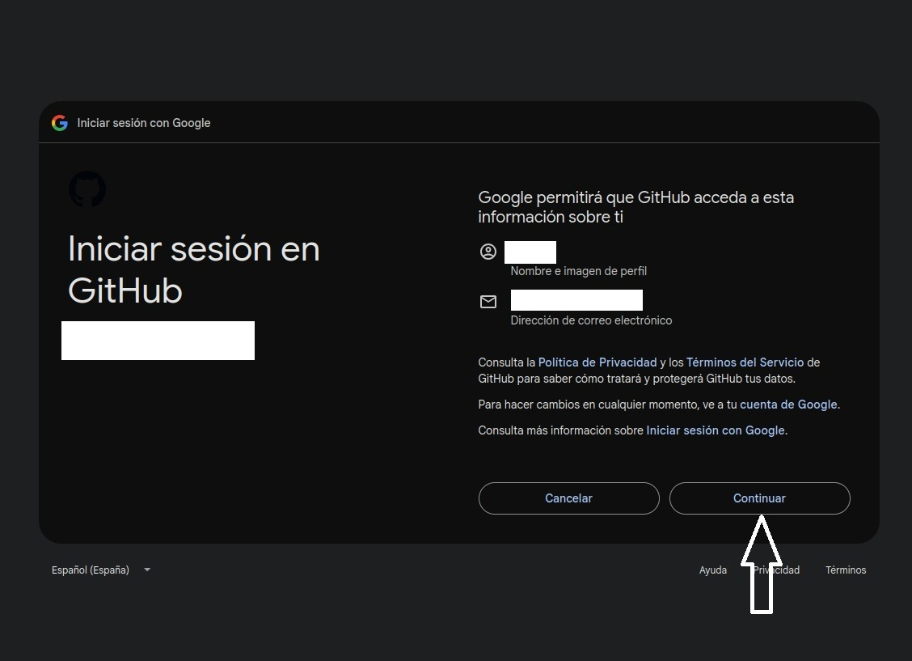
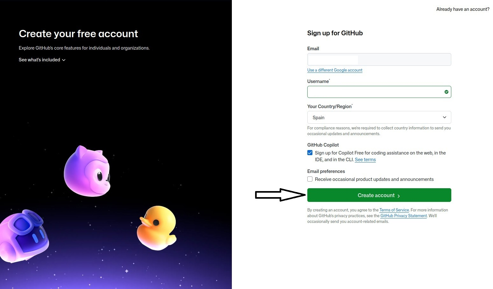
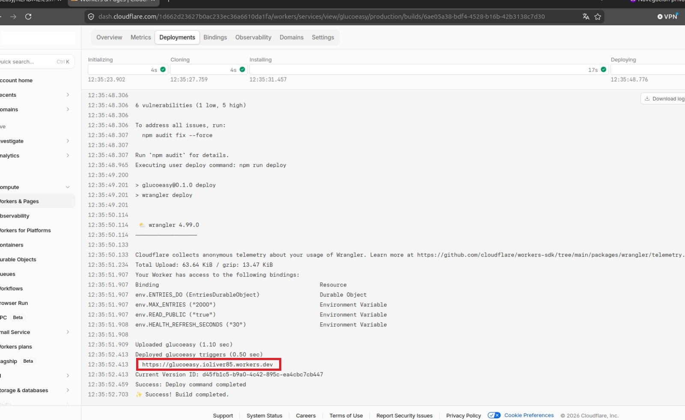
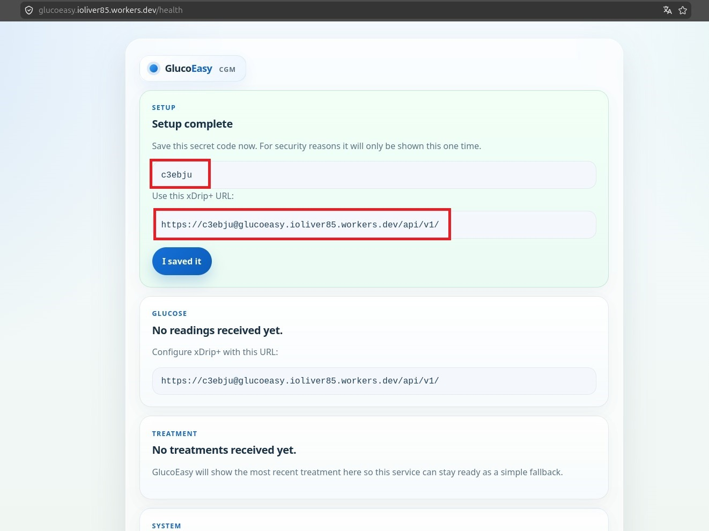

# GlucoEasy

GlucoEasy es un servicio secundario de monitorizacion de glucosa que puedes desplegar gratis en Cloudflare.

Nace para un caso muy concreto: cuando tu servicio principal o el proveedor oficial falla, tener una segunda opcion funcionando te da tranquilidad sin obligarte a mantener una instalacion compleja.

GlucoEasy se centra en lo esencial:

- actuar como respaldo cuando tu servicio principal no responde
- seguir funcionando con apps que ya usan Nightscout
- permitirte usar apps como `xDrip+`, `Zukkah` y otras parecidas
- desplegarse de forma muy facil y gratis en la nube

Version in English: see [README.md](README.md).  
Guía técnica: ver [README.technical.es.md](README.technical.es.md).

## Advertencia Importante

- No es un dispositivo médico.
- No debe usarse para dosificación ni decisiones de tratamiento.
- Usalo solo como respaldo, recuperacion o forma sencilla de mantener tus conexiones funcionando.

## Para Quién Es

Este proyecto es para ti si:

- quieres una segunda opcion cuando falle el servicio principal
- ya usas `xDrip+`, `Zukkah` o cualquier app que funcione con Nightscout
- buscas algo muy facil de instalar y mantener
- quieres un despliegue gratis en la nube
- te importan sobre todo las lecturas de glucosa, los bolos y la compatibilidad amplia

## Qué Hace

- Recibe lecturas de glucosa desde `xDrip+`
- Guarda lecturas recientes y tratamientos
- Se entiende con apps que ya estaban pensadas para Nightscout
- Funciona como servicio secundario para apps y herramientas compatibles
- Muestra una pagina simple de estado en el navegador

## Qué No Hace

- No es Nightscout completo
- No es tu sistema médico principal
- No incluye gráficas, informes ni análisis avanzados

Si necesitas la experiencia completa de Nightscout, Nightscout completo sigue siendo la mejor opción.

## Crear Tu Copia Gratis

La forma mas facil de empezar es pulsar aqui para instalar GlucoEasy gratis.

No hace falta entender que es Cloudflare ni saber "desplegar" nada: solo sigue las pantallas y al final tendras tu enlace listo para usar.

<a href="https://deploy.workers.cloudflare.com/?url=https%3A%2F%2Fgithub.com%2FHankScorpi0%2FGlucoEasy" target="_blank" rel="noopener noreferrer">Instalar GlucoEasy gratis</a>

## Instalacion En 3 Pasos

1. Haz clic en `Instalar GlucoEasy gratis` o en el boton de abajo.
2. Sigue las pantallas hasta que termine la instalacion.
3. Abre el enlace que se crea para ti, por ejemplo `https://tu-worker.workers.dev/health`.

En la primera visita, GlucoEasy crea automaticamente un codigo secreto de 6 caracteres y lo muestra una sola vez. Guardalo en ese momento, porque lo necesitaras en `xDrip+` o en cualquier otra app compatible.

## Guia Detallada De Despliegue

Si es tu primera vez usando Cloudflare Workers, estas son las pantallas y pasos exactos que deberias seguir:

1. Abre el enlace `Instalar GlucoEasy gratis`.
2. En la pantalla de inicio de sesion de Cloudflare, entra con `Google` si esa es la cuenta que quieres usar.


3. En la pantalla `Set up your application`, abre el selector `Git account`.
4. Elige `New GitHub connection`.


5. Se abrira GitHub. Inicia sesion alli y, si tu acceso a GitHub usa Google, pulsa `Continue with Google`.
6. Si todavia no tienes cuenta de GitHub, completa el formulario de registro y crea una.
7. Cuando GitHub pida autorizar `Cloudflare Workers and Pages`, acepta con `Install & Authorize`.







8. Volveras a Cloudflare. Comprueba que tu cuenta de GitHub ya aparece en `Git account`.
9. Deja los valores del proyecto tal como vienen salvo que necesites cambiarlos, y despues pulsa `Deploy`.


10. Espera a que termine el log de despliegue. Al finalizar, Cloudflare mostrara la URL de tu worker, por ejemplo `https://tu-worker.workers.dev`.
11. Abre `https://tu-worker.workers.dev/health`.
12. Guarda el secreto de 6 caracteres que aparece en esa pagina y tambien la URL completa para xDrip+, por ejemplo `https://API_SECRET@tu-worker.workers.dev/api/v1/`.





Si Cloudflare te pide permiso para crear o conectar un repositorio durante la instalacion, aceptalo. Esa conexion es la que permite completar correctamente el flujo de instalacion con un clic.

## Configurar xDrip+

En `xDrip+`, usa la opción `Nightscout Sync REST API` e introduce:

```text
https://API_SECRET@tu-worker.workers.dev/api/v1/
```

Sustituye:

- `API_SECRET` por tu codigo secreto de 6 caracteres
- `tu-worker.workers.dev` por el enlace que se creo para ti

Importante:

- mantén `/api/v1/` exactamente como aparece
- no borres la `/` final

## Apps Compatibles

Como GlucoEasy funciona con el formato que usan muchas apps de Nightscout, puedes conectarlo a:

- `xDrip+`
- `Zukkah`
- otras apps o integraciones que ya funcionen con Nightscout

Ese es uno de sus puntos fuertes: no tienes que cambiar toda tu forma de uso, solo anadir un respaldo.

## Cómo Comprobar Que Funciona

Abre esta página en tu navegador:

```text
https://tu-worker.workers.dev/health
```

Página en español:

```text
https://tu-worker.workers.dev/es/health
```

Ejemplo de la pantalla de estado en espanol:


Deberías ver:

- la última lectura de glucosa
- el último tratamiento, si existe
- cuántas lecturas hay guardadas
- cuántos tratamientos hay guardados

Tambien puedes revisar:

```text
https://tu-worker.workers.dev/api/v1/status.json
```

## Si Algo No Funciona

### No Aparecen Datos

- Comprueba que `xDrip+` use la URL completa con `/api/v1/`
- Comprueba que el codigo secreto sea correcto
- Abre `/health` y revisa si aparecen lecturas recientes

### Error 401

- Lo más probable es que el secreto sea incorrecto
- Usa el mismo secreto de 6 caracteres que viste en la primera configuración

### Has Olvidado El Secreto

- La solución más sencilla suele ser desplegar de nuevo y guardar bien el nuevo secreto
- Los usuarios avanzados pueden cambiarlo manualmente; ver [README.technical.es.md](README.technical.es.md)

### La Página Abre Pero Los Datos Son Antiguos

- Revisa la hora y la zona horaria del teléfono
- GlucoEasy solo conserva las lecturas más recientes

## Licencia

Este proyecto está licenciado bajo MIT. Consulta [LICENSE](LICENSE).
