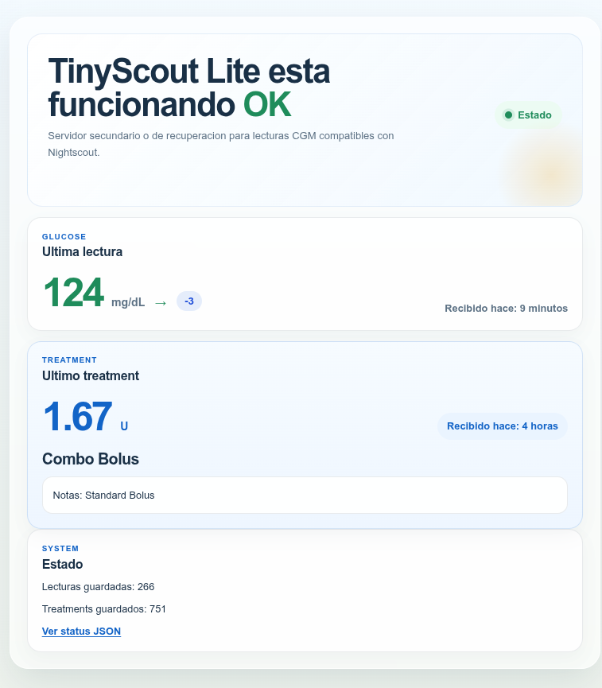

# GlucoEasy

GlucoEasy es un servicio secundario de monitorizacion de glucosa que puedes desplegar gratis en Cloudflare.

Nace para un caso muy concreto: cuando tu servicio principal o el proveedor oficial falla, tener una segunda capa funcionando te da tranquilidad sin obligarte a mantener una instalacion compleja.

GlucoEasy se centra en lo esencial:

- actuar como respaldo cuando tu servicio principal no responde
- seguir exponiendo una API compatible con Nightscout
- permitirte usar apps como `xDrip+`, `Zukkah` y otras compatibles con Nightscout
- desplegarse de forma muy facil y gratis en la nube

Version in English: see [README.md](README.md).  
Guía técnica: ver [README.technical.es.md](README.technical.es.md).

## En Una Frase

GlucoEasy es tu servicio secundario de tranquilidad: cuando falla el principal, sigues teniendo una capa compatible con Nightscout, facil de instalar y gratis en la nube.

## Advertencia Importante

- No es un dispositivo médico.
- No debe usarse para dosificación ni decisiones de tratamiento.
- Usalo solo como respaldo, recuperacion o capa ligera de compatibilidad.

## Para Quién Es

Este proyecto es para ti si:

- quieres una segunda opcion cuando falle el servicio principal
- ya usas `xDrip+`, `Zukkah` o cualquier app compatible con Nightscout
- buscas algo muy facil de instalar y mantener
- quieres un despliegue gratis en la nube
- te importan sobre todo las lecturas de glucosa, los bolos y la compatibilidad amplia

## Qué Hace

- Recibe lecturas de glucosa desde `xDrip+`
- Guarda lecturas recientes y tratamientos
- Replica la forma de la API de Nightscout que usan los clientes existentes
- Funciona como capa secundaria para apps y herramientas compatibles con Nightscout
- Muestra una página simple de `health` en el navegador

## Qué No Hace

- No es Nightscout completo
- No es tu sistema médico principal
- No incluye gráficas, informes ni análisis avanzados

Si necesitas la experiencia completa de Nightscout, Nightscout completo sigue siendo la mejor opción.

## Por Que Existe

La idea no es sustituir tu sistema principal.

La idea es que, si el proveedor oficial o tu servicio principal falla, no te quedes sin una via sencilla para seguir usando el ecosistema Nightscout que ya conoces.

## Despliegue Gratis Mas Rapido

La forma más fácil es usar el flujo oficial de Cloudflare:

<a href="https://deploy.workers.cloudflare.com/?url=https%3A%2F%2Fgithub.com%2FHankScorpi0%2FTinyScout-Lite" target="_blank" rel="noopener noreferrer">
  
</a>

## Instalacion En 3 Pasos

1. Haz clic en el botón `Deploy to Cloudflare`.
2. Sigue las pantallas de Cloudflare hasta que termine el despliegue.
3. Abre la URL que te da Cloudflare, por ejemplo `https://tu-worker.workers.dev/health`.

En la primera visita, GlucoEasy crea automaticamente un `API_SECRET` de 6 caracteres y lo muestra una sola vez. Guardalo en ese momento, porque lo necesitaras en `xDrip+` o cualquier cliente compatible.

## Configurar xDrip+

En `xDrip+`, usa la opción `Nightscout Sync REST API` e introduce:

```text
https://API_SECRET@tu-worker.workers.dev/api/v1/
```

Sustituye:

- `API_SECRET` por tu secreto de 6 caracteres
- `tu-worker.workers.dev` por la URL de Cloudflare

Importante:

- mantén `/api/v1/` exactamente como aparece
- no borres la `/` final

## Apps Compatibles

Como GlucoEasy mantiene compatibilidad con Nightscout, puedes conectarlo a:

- `xDrip+`
- `Zukkah`
- otras apps o integraciones que ya sepan hablar con Nightscout

Ese es uno de sus puntos fuertes: no tienes que reconstruir tu flujo, solo anadir una capa secundaria.

## Cómo Comprobar Que Funciona

Abre esta página en tu navegador:

```text
https://tu-worker.workers.dev/health
```

Página en español:

```text
https://tu-worker.workers.dev/es/health
```

Ejemplo de la pantalla `health` en español:



Deberías ver:

- la última lectura de glucosa
- el último tratamiento, si existe
- cuántas lecturas hay guardadas
- cuántos tratamientos hay guardados

También puedes revisar:

```text
https://tu-worker.workers.dev/api/v1/status.json
```

## Por Que Importa La Compatibilidad Con Nightscout

El valor principal de GlucoEasy no es solo que sea pequeno.

Es que te deja seguir usando el ecosistema que ya conoces incluso como servicio secundario:

- apps moviles
- herramientas de seguimiento
- integraciones que ya hablan con la API de Nightscout

Eso reduce muchisimo la friccion y hace mas facil tener un plan B real.

## Si Algo No Funciona

### No Aparecen Datos

- Comprueba que `xDrip+` use la URL completa con `/api/v1/`
- Comprueba que el `API_SECRET` sea correcto
- Abre `/health` y revisa si aparecen lecturas recientes

### Error 401

- Lo más probable es que el secreto sea incorrecto
- Usa el mismo secreto de 6 caracteres que viste en la primera configuración

### Has Olvidado El Secreto

- La solución más sencilla suele ser desplegar de nuevo y guardar bien el nuevo secreto
- Los usuarios avanzados pueden cambiarlo manualmente; ver [README.technical.es.md](README.technical.es.md)

### La Página Abre Pero Los Datos Son Antiguos

- Revisa la hora y la zona horaria del teléfono
- GlucoEasy solo conserva las lecturas más recientes

## Licencia

Este proyecto está licenciado bajo MIT. Consulta [LICENSE](LICENSE).
