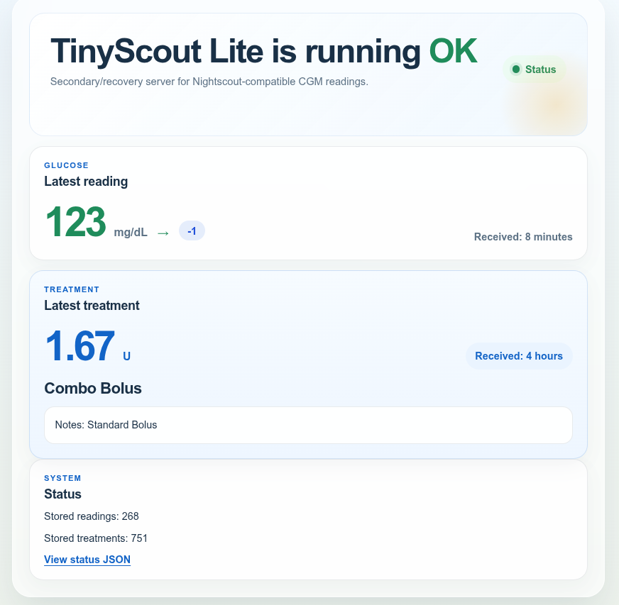

# TinyScout Lite

TinyScout Lite is a very reduced version of Nightscout that you can deploy for free in the cloud with Cloudflare.

Its goal is simple: receive your data and make it available to any Nightscout-compatible app without running a full Nightscout setup.

Spanish version: see [README.es.md](README.es.md).

## In One Sentence

TinyScout Lite gives you a free and simple way to run a Nightscout-compatible service in the cloud.

## Important Warning

- This is not a medical device.
- Do not use it for dosing or treatment decisions.
- Use it only as a backup or recovery option.

## Who This Is For

This project is for you if:

- you already use `xDrip+`
- you want a free cloud deployment
- you want a simple backup if your main provider fails
- you prefer using Nightscout-compatible apps such as `Zukkah`
- you do not want to manage a full Nightscout installation

## What It Does

- Receives glucose readings from `xDrip+`
- Works with Nightscout-compatible apps
- Stores recent readings
- Stores `treatments`
- Shows a simple status page in the browser
- Offers basic Nightscout-compatible endpoints

## When It Makes Sense

- As a secondary service if your official provider fails
- As a simple alternative if you mainly want to feed Nightscout-compatible apps
- If you like unofficial apps such as `Zukkah` that may show data you care about, for example the difference between the current and previous glucose reading
- If you want something very small, free, and easy to deploy

## What It Does Not Do

- It is not full Nightscout
- It is not your primary system
- It does not include every Nightscout feature
- It does not provide a full web app with charts, reports, or advanced analysis

## If You Want Charts And Reports

If you want a full web app with charts, reports, and richer analysis tools, Nightscout is the better choice.

## Fastest Free Deployment

The easiest way is the official Cloudflare flow:

<a href="https://deploy.workers.cloudflare.com/?url=https%3A%2F%2Fgithub.com%2FHankScorpi0%2FTinyScout-Lite" target="_blank" rel="noopener noreferrer">
  
</a>

## Deploy In 3 Steps

1. Click the `Deploy to Cloudflare` button.
2. Follow the Cloudflare screens until the deployment finishes.
3. Open the URL Cloudflare gives you, for example `https://your-worker.workers.dev/health`.

On the first visit, TinyScout Lite creates a 6-character `API_SECRET` automatically and shows it once. Save it immediately. You will need it in `xDrip+`.

## Compatibility

TinyScout Lite is designed to work with apps that already support Nightscout.

## Configure xDrip+

In `xDrip+`, use the `Nightscout Sync REST API` option and enter:

```text
https://API_SECRET@your-worker.workers.dev/api/v1/
```

Replace:

- `API_SECRET` with your 6-character secret
- `your-worker.workers.dev` with your Cloudflare URL

Important:

- keep `/api/v1/` exactly as shown
- do not remove the final `/`

## Check That It Works

Open this page in your browser:

```text
https://your-worker.workers.dev/health
```

Spanish page:

```text
https://your-worker.workers.dev/es/health
```

English `health` page example:



You should see:

- the latest glucose reading
- the latest treatment, if any
- how many readings are stored
- how many treatments are stored

You can also check:

```text
https://your-worker.workers.dev/api/v1/status.json
```

## If Something Does Not Work

### No Data Appears

- Check that `xDrip+` is using the full URL with `/api/v1/`
- Check that the `API_SECRET` is correct
- Open `/health` and see whether recent readings appear

### Error 401

- The secret is probably wrong
- Use the same 6-character secret shown during the first setup

### You Forgot The Secret

- The easiest fix is usually to deploy again and save the new secret carefully
- Advanced users can replace it manually with Wrangler secrets

### The Page Opens But Data Is Old

- Check the phone time and timezone
- TinyScout Lite only keeps the most recent entries

## Advanced Notes

TinyScout Lite also supports:

- `entries`
- `treatments`
- minimal `profile` support
- `devicestatus` as an empty collection for compatibility

Current profile support includes:

- `GET /api/v1/profile/current`
- `GET /api/v1/profile`
- `POST /api/v1/profile`
- `PUT /api/v1/profile`

Current limitations:

- it is not full Nightscout
- it does not implement delete routes for `treatments`
- it does not keep full profile history

## Technical Reference

### Environment Variables

- `API_SECRET`: optional manual secret override
- `READ_PUBLIC`: `true` in this configuration
- `MAX_ENTRIES`: `2000` by default
- `HEALTH_REFRESH_SECONDS`: `30` by default, minimum effective value `5`

### Main Endpoints

- `POST /api/v1/entries`
- `GET /api/v1/entries`
- `GET /api/v1/entries/current`
- `GET /api/v1/status.json`
- `POST /api/v1/treatments`
- `GET /api/v1/treatments`
- `GET /api/v1/profile/current`
- `GET /api/v1/profile`
- `POST /api/v1/profile`
- `PUT /api/v1/profile`
- `GET /api/v1/devicestatus`
- `GET /health`
- `GET /es/health`

## Local Development

```bash
npm install
npm run test
npm run dev
```
